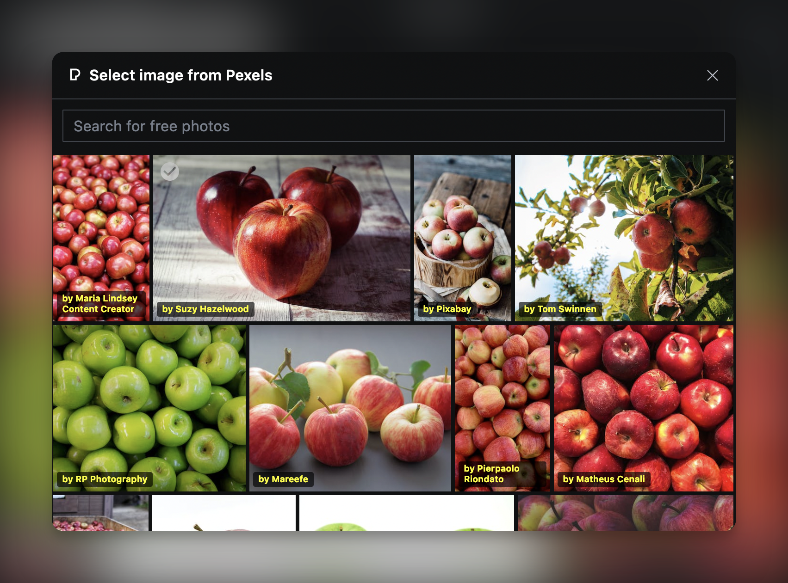
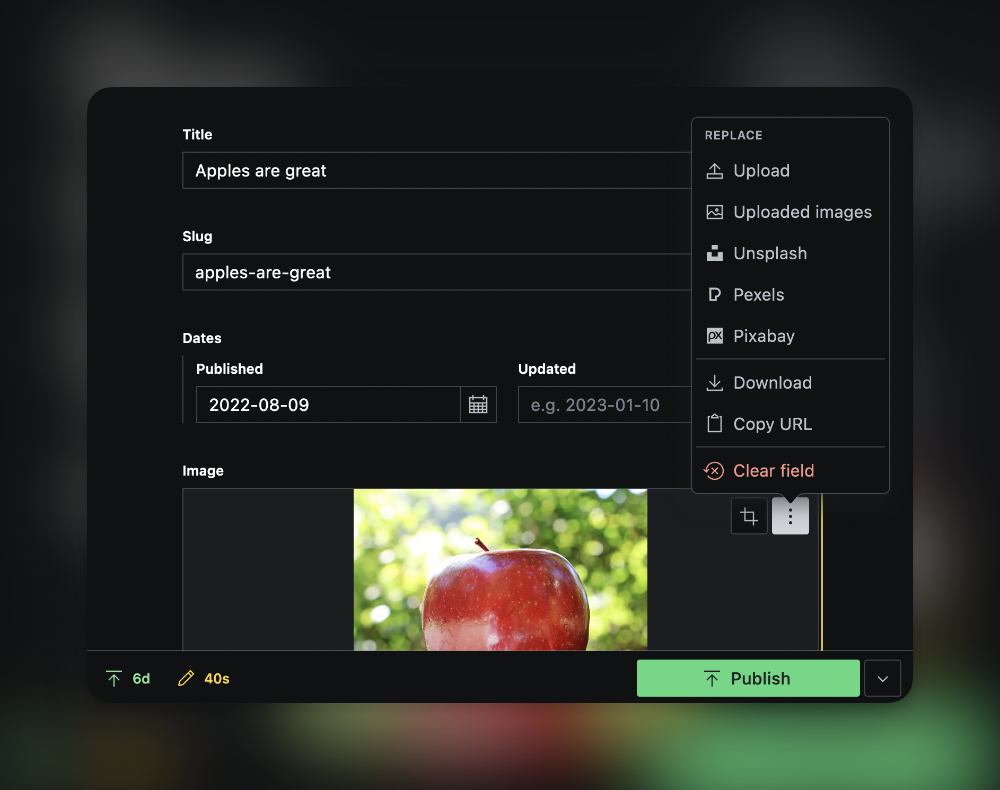

# sanity-plugin-asset-source-stock-images

> This is a **Sanity Studio v3** plugin.

## What is it?

Search for photos in Pexels & Pixabay (Unsplash support is coming) and add them to your project right inside of Sanity Studio




## Installation

```sh
npm install sanity-plugin-asset-source-stock-images
```

## Usage in code

Import & add the image providers you want as plugins in `sanity.config.ts` (or .js):

```ts
import {defineConfig} from 'sanity'
import {pixabayStockImagesAsset, pexelsStockImagesAsset} from 'sanity-plugin-asset-source-stock-images'

export default defineConfig({
  //...
  plugins: [pixabayStockImagesAsset(), pexelsStockImagesAsset()],
})
```

## Usage in Studio
- Clicking on the white checkmark selects the photo for upload (this will allow for clicking on the photo itself in the future to render a lightbox)

## Notes

- You will be prompted for an API token for each unique plugin upon use of that plugin. 
  - Pexels API docs: https://www.pexels.com/api/
  - Pixabay API: https://pixabay.com/api/docs/
- This plugin took me a good deal of time to create and I'm open sourcing it:
please consider adding improvements if you enjoy it, or please consider
throwing some fun freelance projects my way!

## Todo

- Add infinite scrolling
- Add some configurability (theming, naming, querying, amount of results per page, etc)
- ~~Add ability to reset api key in interface easily~~
- Remove pexels-api, hit API directly

## License

[MIT](LICENSE) © Silouan Wright

## Develop & test

This plugin uses [@sanity/plugin-kit](https://github.com/sanity-io/plugin-kit)
with default configuration for build & watch scripts.

See [Testing a plugin in Sanity Studio](https://github.com/sanity-io/plugin-kit#testing-a-plugin-in-sanity-studio)
on how to run this plugin with hotreload in the studio.


### Release new version

Run ["CI & Release" workflow](https://github.com/reywright/sanity-plugin-asset-source-stock-images/actions/workflows/main.yml).
Make sure to select the main branch and check "Release new version".

Semantic release will only release on configured branches, so it is safe to run release on any branch.